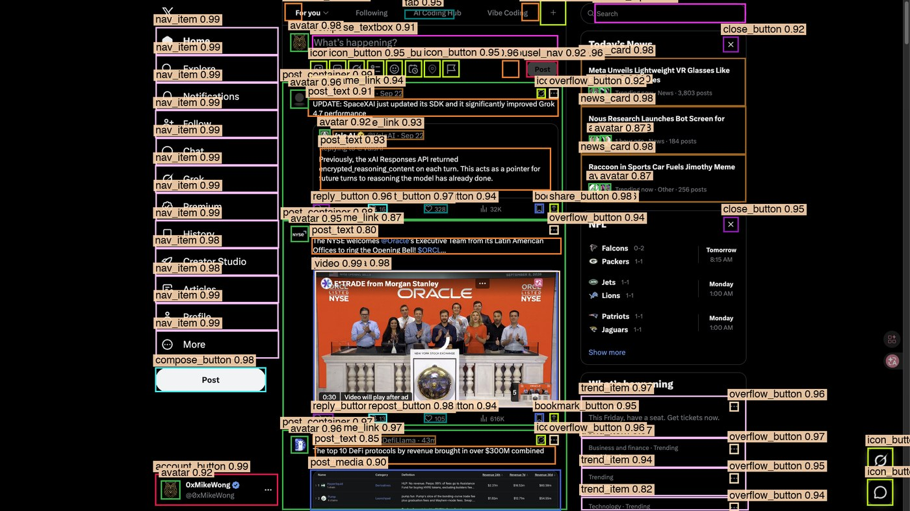
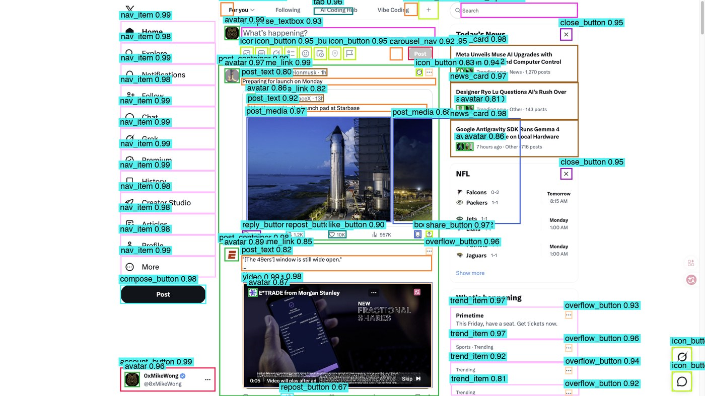
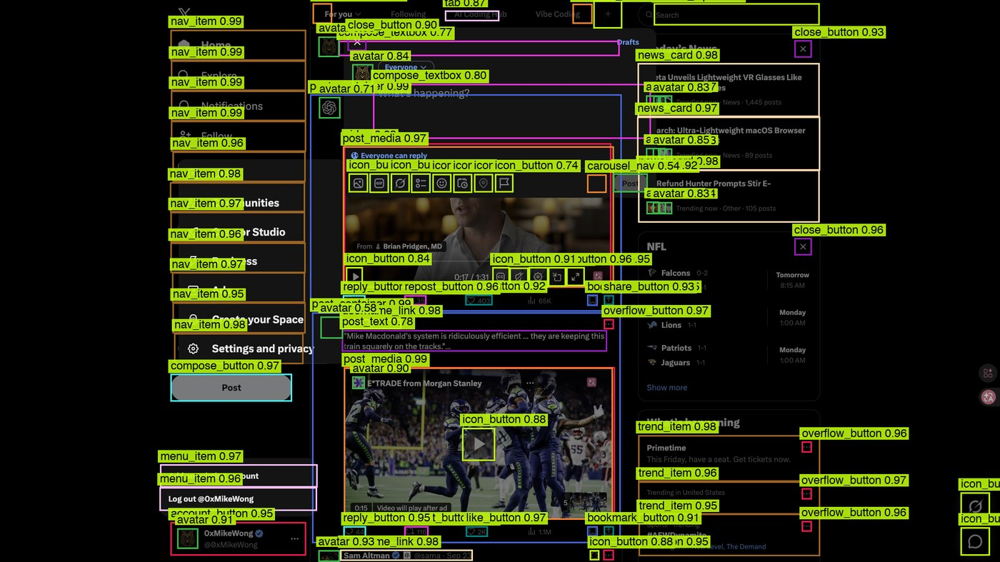
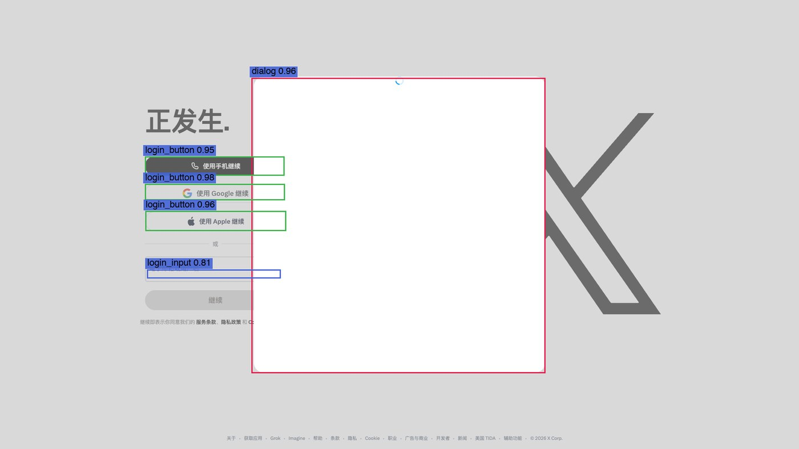
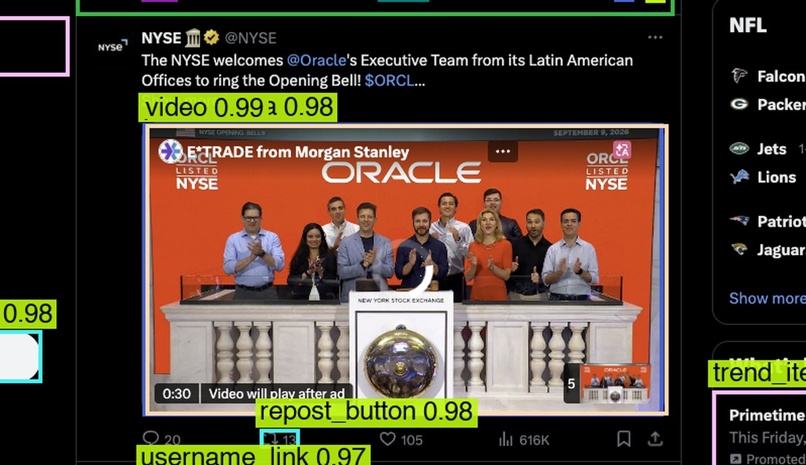

# x-ocr：X-specific 纯视觉 UI 感知模型实验

> **命题**（[docs/task_spec.md](docs/task_spec.md)）：运行时只看 screenshot、参数几百万的专用检测器，能否替代 X 场景下昂贵的通用 GUI parsing？
> 运行时禁令：无 DOM / 无 Playwright / 无 OmniParser / 无 VLM——`runtime/api.py` 的 `assert_pure_runtime()` 可机器验证。
> DOM 只在**训练期**当教师（标注来源/清洗裁判/校准器/迁移指南），运行时纯视觉。

## 识别效果（截图进，结构出 · 纯视觉无 DOM）

| 深色主题 · 信息流 | 浅色主题 · 信息流 |
|---|---|
|  |  |

| 弹窗 / 菜单态 | 未登录 · 登录墙 |
|---|---|
|  |  |

**单帖感知特写**——username → 正文 → 操作行，语义一次给齐（模型直出，conf≥0.5）：



再往上一层就是结构化屏幕文档（`runtime/screen_doc.py`，~500 token 即可喂给 LLM agent）：

```json
{"theme": "dark", "nav": [{"name": "Home", "click": [458, 81]}, ...],
 "posts": [{"author": "颜探长 @laoyan86 · 6h",
             "text": "……",
             "actions": {"reply_button": [499, 560], "like_button": [939, 560],
                          "repost_button": [719, 560], "share_button": [1272, 560]}},
            ...],
 "search": {"click": [1414, 27]}, "right_rail": [{"type": "trend", "text": "..."}]}
```

## TL;DR（最终结果，exp010）

| 指标 | 数值 |
|---|---|
| 模型 | YOLO11-nano **2.6M 参数**（fp32 ONNX 11.1MB / fp16 5.6MB） |
| 数据 | 826 张 / 47,778 元素 / 双主题 / 登录+未登录 / frozen test 21 图 |
| **mAP50 / mAP50-95** | **0.935 / 0.876**（P 0.915 / R 0.927） |
| 关键交互元素召回 | reply/like/repost/bookmark/share ≈0.95+，nav 0.99，username 0.93 |
| 推理速度 | **190ms/帧**（CPU ONNX Runtime），OmniParser 同机 3.6s 且漏检 62% |
| 主题泛化 | light 主题 micro-recall **2.4% → 91.9%**（134 张 light 增量训练，暗色 frozen test 无损） |
| 结构化屏幕文档 | screenshot → ~400-600 token JSON（nav/posts/author/actions/right_rail） |
| Agent 闭环 | 视觉点击 + 120px 区域像素验证；policy prompt 仅 401 token |

模型下载：**[Release model-v1.0-exp010](../../releases/tag/model-v1.0-exp010)**（fp32/fp16 ONNX + metrics + taxonomy + 独立推理示例）。
完整报告：[docs/technical_report.md](docs/technical_report.md) ｜ 15 问终答：[docs/final_report.md](docs/final_report.md)

## 实验历程

| # | 实验 | 数据 | mAP50 | mAP50-95 | 说明 |
|---|---|---|---|---|---|
| 1 | exp001_smoke | 53 图 | 0.000 | 0.000 | 3ep 冒烟：Colab 训练→评测→ONNX 回下载全链路打通 |
| 2 | exp002_baseline_nano | 87 图 | 0.542 | 0.466 | 60ep@1280 基线；test 仅 7 图噪声大 |
| 3 | exp003_nano_v03 | 248 图 | 0.845 | 0.751 | Stage 0 扩量 + frozen test 建立 |
| 4 | exp004_small_v03 | 248 图 | 0.941 | 0.876 | small(9.4M) 上限参照：+9.6pt，但参数×3.6 |
| 5 | exp005_nano_v04_al | 235 图 | 0.902 | 0.813 | active-learning：菜单/弹窗/threads 定向补采 |
| 6 | exp006_nano_final | 511 图 | 0.933 | 0.860 | 量产后 mAP 收敛；light 主题 probe 仅 2.4% → 暴露分布缺口 |
| 7 | exp008_nano_light_a100 | 645 图 | 0.932 | 0.872 | +134 张 light（RustDesk 远程切主题）；light recall 91.9%，暗色 frozen 无损 |
| 8 | exp009_nano_32class_a100 | 681 图 | 0.930 | 0.866 | +login_input/login_button（未登录态，独立 playwright 采集） |
| 9 | **exp010_nano_v1_0** | **826 图** | **0.935** | **0.876** | v1.0 战役：text_spans 提取器 + 全类收口，最终发布模型 |

关键横向对比（同机）：OmniParser icon_detect 漏检 62% 元素、3.6s/帧；本模型 190ms/帧、32 类语义角色（非裸 icon 框）。

## 方法：DOM 四角色（训练期专用）

```
capture-truth   同帧 DOM rect = 零误差图像标注（data-testid 语义锚定，confidence 1.0）
training-teacher fused 标注 + provenance（dom-testid/dom-aria/heuristic 三档置信）
runtime-calibrator 可选：box 吸附 + FP 过滤 + 类别仲裁（IoU≥0.55）+ 精确文本（text_spans）
migration-guide  规则可移植到第二个 app（M3 计划）
```

纯视觉链路：`screenshot → ONNX detector(32类) → 几何分组 → 按需裁剪 OCR(RapidOCR) → screen_document(JSON)`；
hybrid 模式叠加 DOM 校准（author 由 OCR 噪声「Gazi √」变为精确「颜探长 @laoyan86 · 6h」）。

## 交付物

- `runtime/api.py` 纯视觉 `parse_screen()`（ONNX Runtime，纯度断言）＋ `verify.py`（结构不变式 + 像素级状态变化验证 0.38 vs 0.12）
- `runtime/screen_doc.py` 结构化屏幕文档（username 锚定分组：author/text/actions 正确配对，含 quote/截断帖处理）
- `runtime/hybrid.py` 一调用感知：截图先行 + DOM 稳定性守卫（重排期自动回落纯视觉）
- `runtime/agent.py` 参考 agent：perceive→policy→Executor（视觉点击+区域像素验证），401-token prompt
- `tools/sidepanel-ext/` MV3 侧边栏扩展：实时 captureVisibleTab → 本地 parse → canvas overlay + 文档视图
- `scripts/cleaning_flywheel.py` 模型↔DOM 全库交叉检查 → 715 规则缺口 + 2199 困难样本（M1 训练燃料）
- `scripts/demo_server.py` :8800 演示站（gallery / report / POST /api/parse）
- 数据 Releases `data-v0.1 → v1.0-textspans`（GitHub 中转，VM 内 1s 拉取）

## 快速使用（模型）

```bash
# 下载 Release 资产后（或直接用本仓库 experiments/latest/）
pip install onnxruntime pillow pyyaml
python example_inference.py best_onnx_fp32.onnx ui_taxonomy.yaml shot.png
# → [{role: 'like_button', bbox: [x1,y1,x2,y2], confidence: 0.94}, ...]
```

## 从零复现

### 0. 依赖与浏览器
```bash
uv venv --python 3.12 .venv
uv pip install --python .venv/bin/python playwright pillow pyyaml imagehash pytest onnxruntime
# Chrome 装 "Playwright Extension" 扩展（chrome.google.com/webstore，id mmlmfjhmonkocbjadbfplnigmagldckm）
# 扩展 status 页显示 token → 存入 .env.local:
echo 'PLAYWRIGHT_MCP_EXTENSION_TOKEN=<token>' > .env.local
echo 'PW_SESSION=xocr' >> .env.local
npm i --prefix tools/pwcli   # pin @playwright/cli@0.1.21（协议 v2，须与扩展匹配）
./scripts/pw attach --extension=chrome   # 复用日常 Chrome（含 X 登录态）
```

### 1. 采集（安全：仅导航/滚动/开关菜单弹窗，无公开动作；截图先行+双重 DOM 指纹稳定性守卫）
```bash
.venv/bin/python collector/collect.py --session s01 --target 100 \
  --states feed,menus,threads --viewports 1920x1080,1440x900,1280x720
.venv/bin/python collector/collect_loggedout.py   # 未登录态（独立本地 playwright）
```
产出 `data/raw/<session>/<seq>/{shot.png,anno.json,meta.json}`（phash、route、viewport、theme、stable）。

### 2. 标注融合 + 数据集导出 + hard_test + 可视化
```bash
.venv/bin/python annotation/fuse.py              # 裁剪/同角色去重/phash 近重复消除/provenance
.venv/bin/python dataset/export_yolo.py          # YOLO 格式 + session×route group split（防泄漏）
.venv/bin/python scripts/build_hard_test.py      # 菜单/弹窗/密集流等困难样本
.venv/bin/python scripts/visualize_overlay.py --montage   # 人工检查
```

### 3. 训练（全部在 Colab，本地零 torch）
```bash
./scripts/make_bundle.sh                                   # 代码+数据集打包
gh release create data-vX <zip>                            # 数据中转（VM 内 1s 拉取）
./scripts/colab_train.sh exp010_nano_v1_0 100 data/yolo yolo11n.pt 1280
# 或用 notebooks/train_colab.ipynb 手动跑
```

### 4. 评测 + 错误分析（frozen test split 自 v0.3 冻结）
```bash
# VM 上：python evaluation/eval_frozen.py ...（KIER/per-class）
#        python evaluation/error_analysis.py ...（FP/FN/低置信 montage）
```

### 5. Runtime 推理（纯视觉证明）
```bash
.venv/bin/python -c "
from runtime.api import parse_screen
print(parse_screen('shot.png'))   # [{role, bbox(xyxy), confidence}, ...]
"
```

### 6. 结构化文档 / hybrid / agent
```bash
.venv/bin/python -c "from runtime.screen_doc import screen_document; print(screen_document('shot.png'))"
.venv/bin/python scripts/demo_server.py        # :8800 演示站（含 POST /api/parse）
.venv/bin/python scripts/vision_automation_demo.py   # agent 视觉点击闭环
```

## 工程地图

```
collector/   采集（playwright-cli 扩展会话驱动真实 Chrome；loggedout 独立通道）
annotation/  DOM 标注融合（fuse.py）
teacher/     OmniParser 对比（omniparser_compare.py）
dataset/     YOLO 导出 + group split + frozen split
training/    Colab 训练脚本（train_yolo.py：train+val+ONNX 导出）
evaluation/  frozen 评测（eval_frozen.py）+ 错误分析（error_analysis.py）
runtime/     api(parse_screen) / screen_doc / hybrid / calibrate / agent / verify
schema/      ui_taxonomy.yaml（32 类 X 专属 agent-oriented 角色）
docs/        task_spec / research / system_boundary / goal / technical_report / final_report
scripts/     pw wrapper / colab_train.sh / campaign / overlays / flywheel / demo_server
tools/       sidepanel-ext（MV3 侧边栏）/ pwcli
experiments/ expXXX（config+metrics+ONNX）
```

## 已知边界（[docs/system_boundary.md](docs/system_boundary.md)）

- **扩展 Input 通道不可用**（实证：CDP 鼠标/键盘事件 0 到达）→ 一切交互走页面内 eval；
  light 主题采集需真实切换系统主题（RustDesk 远程操作一次即可）。
- **DOM/截图竞态**：X 懒加载重排可使 DOM 坐标过期 ~100px → 采集/校准均有双重提取稳定性守卫，重排帧丢弃。
- Colab VM 临时 → 数据集走 GitHub Release 中转（本机零重复流量）；A100 会被回收 → nohup + 服务端 watch。
- 训练一律 Colab（用户策略）；本地仅采集/数据集/ONNX 推理。
- 视口分布 1280–1920；更小视口（如 1236×778）为 OOD，M2 计划做多尺度增广。
- M1 待办：消化 flywheel 的 715 规则缺口 + 2199 困难样本（icon_button×171 / video×77 / post_media×70 为主）。

## License 提示
主实验 ultralytics YOLO11 为 **AGPL-3.0**（商用闭源需注意，报告已记录，YOLOX(Apache) 为备选）；OmniParser icon_detect_v3
基于 MIT 的 YOLOv9；ScreenParse 生态 MIT/Apache-2.0。数据集为真实 X 截图，仅研究用途，不入公开仓库。
